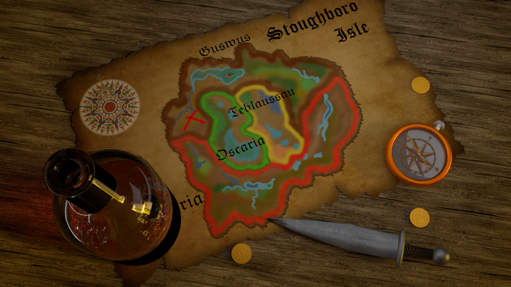

# TL;DR: [this file](./final-render.png), also [this](./main.blend)

AKA "If it's worth doing, it's worth doing with excess."

This was apparently a task on geometry reasoning -- how to draw 4 areas on a flat plane so that each touches the 3 other ones.
There was half-a-point awarded for "prettiness", but the task was still on geometry.

At which point did I turn it around into a photorealism 3D exercise I have no idea.
I'm guessing I was bored.
Nevertheless, I'm quite happy with how it turned out.

(Sidenote: this took `01:52:51.16` to render.
That's because I rendered it on a CPU, because I was an idiot and broke the CUDA support on my laptop.
In the future, my advice is: do *NOT* break CUDA support; that will only end in tears later.)

All copyrighted objects are credited where available.
Mostly that includes things like textures.
If there is no credits info, it means that either I couldn't find a source, but it's easy to find online and thus under Fair Use, or I made it myself.
